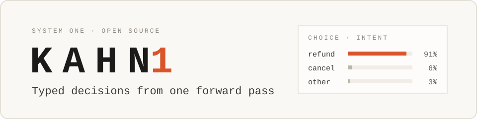
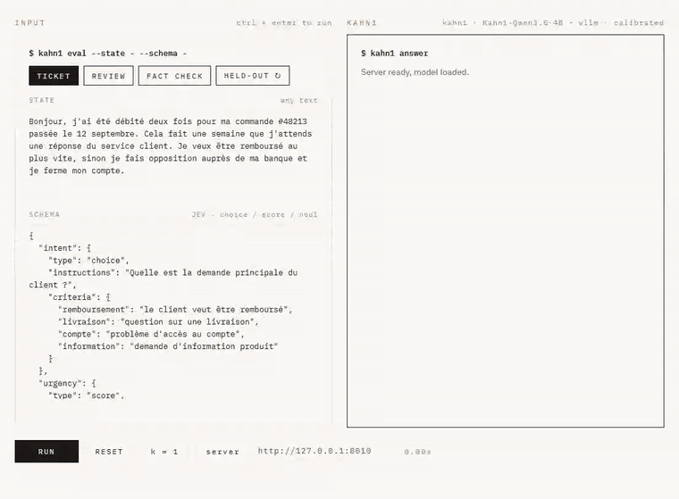
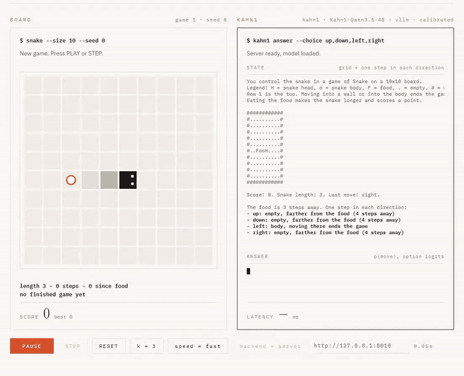

<p align="center">
  <a href="https://kahn1.com/"></a>
</p>

<p align="center">
  <a href="https://huggingface.co/Okura66/Kahn1-Qwen3.5-4B"></a>
  <a href="LICENSE"></a>
  <a href="#models"></a>
  <a href="https://kahn1.com/"></a>
  <a href="tests/"></a>
</p>

<p align="center">
  <b>Kahn1</b> is an open-source System One model: ask typed questions about a text (Choice, Score, Noul) and get typed
  answers, each with its full distribution and a calibrated confidence, from a model you run yourself.
</p>

<p align="center">
  <a href="https://kahn1.com/playground/">Playground</a> ·
  <a href="https://kahn1.com/snake/">Kahn1 plays Snake</a> ·
  <a href="https://kahn1.com/benchmarks/">Benchmarks</a> ·
  <a href="https://kahn1.com/get-started/">Get started</a> ·
  <a href="https://kahn1.com/fr/">Français</a>
</p>

<table>
  <tr>
    <td width="50%" valign="top"></td>
    <td width="50%" valign="top"></td>
  </tr>
  <tr>
    <td valign="top"><b>Playground.</b> Paste any text, write a JEV schema, get each answer with its distribution.</td>
    <td valign="top"><b>Snake.</b> Kahn1 picks every move: about 130 ms a move at k = 3 in this recording.</td>
  </tr>
</table>

<sub>Both recorded with Kahn1 4B (<code>Okura66/Kahn1-Qwen3.5-4B</code>) served locally with vLLM, k = 3 for Snake. The
in-browser versions on kahn1.com run a 4-bit GGUF of the 3B instead.</sub>

## Why Kahn1

- **Typed by construction.** Each answer is read from the probabilities of the option tokens, so there is no text
  to parse and no schema error; you get the whole distribution, not just the top answer.
- **Calibrated confidence you can threshold.** Kahn1 4B's ECE on the 14,663-item held-out set is 0.072 overall,
  0.015 on Choice: automate the confident cases, escalate the rest.
- **Open and local.** Code MIT, Kahn1 4B weights Apache 2.0. One GPU serves it (median 88.7 ms per request at
  k = 3 on an RTX 5070 Ti), a CPU runs it at seconds per question, and nothing is billed per call.
- **Speaks JEV's schema.** `POST /v1/evaluate/jev` takes JEV's question fields (`type`, `instructions`,
  `criteria`); JEV clients that call `/v1/systemone` need a small adapter.

## Quickstart

```bash
git clone https://github.com/Okura66/kahn1 && cd kahn1
uv venv --python 3.11 && uv pip install -e ".[gpu]"      # vLLM, CUDA GPU; CPU install below
SYSONE_MODEL=Okura66/Kahn1-Qwen3.5-4B uv run sysone serve --port 8000
```

Then ask it something:

```bash
curl -X POST http://127.0.0.1:8000/v1/evaluate \
  -H "Content-Type: application/json" \
  -d '{"state":"A frustrated customer.","questions":[{"kind":"choice","key":"q","prompt":"Intent?","options":["cancel","refund","help"],"allow_other":true}],"n_permutations":3}'
```

No GPU? See [Running on CPU](#running-on-cpu-no-gpu-required). The full guide, with an AI-agent setup prompt, is at
[kahn1.com/get-started](https://kahn1.com/get-started/).

## Results at a glance

Like for like: on the held-out set every system answers the same questions over the same options (Choice over the
same 8 options); JevBench is the 231 public items of an external benchmark. Kahn1: k = 3, temperature calibration.
Clef-flash, Tev1 and Laya: run by us on the same GPU, each through its own release code, in its shipped setting.

| | Kahn1 4B | Kahn1 3B | JEV 1.13.0 | JevK5 v0.2 | Clef-flash (int8) | Tev1 4B | Laya |
|---|---:|---:|---:|---:|---:|---:|---:|
| Held-out, 14,663 items | 72.4 % | 70.3 % | 73.2 % | not run | **74.8 %** | 72.0 % | 59.1 % |
| Held-out ECE, lower is better | 0.072 | 0.082 | 0.113 | not run | 0.101 | **0.060** | 0.184 |
| JevBench, 231 public items | **87.4 %** | 67.5 % | 86.6 % | 86.1 % | 83.5 % | 76.2 % | 57.6 % |
| JevBench, hard tier (111 items) | **75.7 %** | 42.3 % | 73.0 % | 73.9 % | 67.6 % | 52.3 % | 32.4 % |

- JEV is ahead on the held-out set overall and on Choice (94.5 % vs 92.3 %, 79.1 % vs 71.6 % over every intent);
  the two are level on Score and Kahn1 4B is ahead on Noul (75.5 % vs 74.4 %).
- On JevBench, Kahn1 4B is on par with Jev (202 vs 200 items, exact McNemar p = 0.84) and with JevK5's own run
  (p = 0.68). Three runners on the same items: ours for Kahn1, JevBench's for Jev, JevK5's authors' for JevK5
  (JevBench's own run of JevK5 v0.2 scores 85.3 %).
- Cloudflare's [Clef-flash](https://huggingface.co/Cloudflare/clef-flash) (9B; int8 here, its 18.8 GB of bf16 weights
  do not fit in 16 GB) is the most accurate on the held-out set, significantly ahead of Kahn1 4B (p = 6e-15), on the
  strength of Choice (98.6 % vs 92.3 %); Kahn1 4B is ahead on Noul and better calibrated, and the two are level on
  JevBench (p = 0.16). Together's [Tev1-4B-experimental](https://huggingface.co/togethercomputer/Tev1-4B-experimental),
  on the same base as Kahn1 4B, is level with it on the held-out set (p = 0.15), better calibrated and ahead on Noul, but
  far behind on JevBench (p = 4e-5); it was trained on BANKING77 and SST-5. [Laya](https://huggingface.co/convaiinnovations/laya)
  (421M encoder) is far behind on both, although it was trained on the six held-out sources. Method, biases and a train-split probe:
  [kahn1.com/benchmarks/open-models](https://kahn1.com/benchmarks/open-models/),
  [`reports/OPEN_DECISION_MODELS.md`](reports/OPEN_DECISION_MODELS.md).

Every table, per dataset and per primitive: [Benchmark results](#benchmark-results) below and
[kahn1.com/benchmarks](https://kahn1.com/benchmarks/).

## Models

Two sizes of one model, each as a merged checkpoint and as a LoRA adapter; both run on a GPU (vLLM) and on a CPU
(transformers), and each Hugging Face repository ships its `calibration.json`.

| | Kahn1 4B | Kahn1 3B |
|---|---|---|
| Base model | `Qwen/Qwen3.5-4B` | `Qwen/Qwen2.5-3B-Instruct` |
| Merged model | [`Okura66/Kahn1-Qwen3.5-4B`](https://huggingface.co/Okura66/Kahn1-Qwen3.5-4B) · 8.4 GB | [`Okura66/Kahn1-Qwen2.5-3B`](https://huggingface.co/Okura66/Kahn1-Qwen2.5-3B) · 6.17 GB |
| LoRA adapter | [`Okura66/Kahn1-Qwen3.5-4B-LoRA`](https://huggingface.co/Okura66/Kahn1-Qwen3.5-4B-LoRA) · 57 MB | [`Okura66/Kahn1-Qwen2.5-3B-LoRA`](https://huggingface.co/Okura66/Kahn1-Qwen2.5-3B-LoRA) · 239 MB |
| Prompt format | native chat template (thinking off), picked automatically | tag layout, picked automatically |
| Weights licence | Apache 2.0 | [Qwen Research License](https://huggingface.co/Qwen/Qwen2.5-3B-Instruct/blob/main/LICENSE), a research licence: see its terms |
| Median latency (k = 3) | 88.7 ms | 36.4 ms |

The 4B is the stronger one, above all on hard judgment calls; the 3B is smaller and faster. The browser demos run a
smaller 4-bit GGUF build of the 3B ([mradermacher/Kahn1-Qwen2.5-3B-GGUF](https://huggingface.co/mradermacher/Kahn1-Qwen2.5-3B-GGUF)),
older than the published 3B weights. Details: [kahn1.com/models](https://kahn1.com/models/).

<details>
<summary><b>Serve with plain vLLM, or load a LoRA adapter</b></summary>

```bash
# Serve directly with vLLM (prefix caching on; it pays off on long states, see reports/LATENCY_PREFIX.md):
vllm serve Okura66/Kahn1-Qwen3.5-4B --enable-prefix-caching --dtype bfloat16 --max-model-len 4096
vllm serve Okura66/Kahn1-Qwen2.5-3B --enable-prefix-caching --dtype bfloat16

# Or through sysone, which reads the answers from the logits (prompt format picked automatically):
SYSONE_MODEL=Okura66/Kahn1-Qwen3.5-4B uv run sysone serve --port 8000
```

```python
from transformers import AutoModelForCausalLM, AutoTokenizer
from peft import PeftModel
import torch

base = AutoModelForCausalLM.from_pretrained("Qwen/Qwen3.5-4B", dtype=torch.bfloat16, device_map="auto")
tokenizer = AutoTokenizer.from_pretrained("Okura66/Kahn1-Qwen3.5-4B-LoRA")
model = PeftModel.from_pretrained(base, "Okura66/Kahn1-Qwen3.5-4B-LoRA")
# Kahn1 3B: base "Qwen/Qwen2.5-3B-Instruct", adapter "Okura66/Kahn1-Qwen2.5-3B-LoRA"
```

</details>

## Documentation

- [Get started](https://kahn1.com/get-started/): install, serve, the API and the response format, calibration.
- [Benchmarks](https://kahn1.com/benchmarks/) and [caveats](https://kahn1.com/caveats/): what was measured, and where Kahn1 is weak.
- [`docs/PLAYBOOK.md`](docs/PLAYBOOK.md): retrain on your own data or on another open model.
- [`reports/`](reports/): the evaluation reports, starting with [`KAHN1_4B_REPORT.md`](reports/KAHN1_4B_REPORT.md).
- [What a System One model is](https://kahn1.com/learn/system-one-models/), and [the landscape of decision models](https://kahn1.com/compare/landscape/).

---

## What Kahn1 does

Named after Daniel Kahneman (*Thinking, Fast and Slow*): the fast, intuitive System 1 of the
book, next to a slow System 2. `sysone` is the Python framework behind it.

- Takes a **state** (arbitrary text context) and a **list of typed questions** (Choice / Score / Noul).
- Returns **strictly typed values + calibrated probability distributions**.
- Handles **few options or many**: above 26 options, a two-stage router narrows the list before the Choice.
- Evaluates all questions in a **single batch**; vLLM's prefix caching reuses the state's computation across them when the state is long enough (it caches Kahn1 4B's prefix in 528-token blocks, so short states are recomputed for each question).
- Schema/type errors are **guaranteed zero by construction** (Pydantic types, no text parsing).

## What Kahn1 does not do (honestly)

- **Does not match the intelligence of a frontier model** on ambiguous subjective judgments (a 4B or 3B model makes no such claim).
- **Is not more accurate than JEV or Clef-flash on its own held-out set**: asked the same questions over the same options, JEV 1.13.0 is ahead overall and on Choice, level on Score, and Clef-flash (9B) is ahead of both (see [Benchmark results](#benchmark-results)).
- **Does not use TypeSafe's proprietary sampler or architecture**.
- **Calibration is valid only for the training distribution** — hence the `sysone calibrate` command to recalibrate on your domain.
- **Latency comes from answering at a single position per question**, helped by prefix caching on long states only, not from an exotic architectural innovation. It grows with the number of questions per request.

---

## When to use it

<details>
<summary><b>Real-World Enterprise Use Cases</b></summary>

`sysone` is designed to be the **fast sensory cortex ("System 1")** of automated enterprise infrastructure, routing workflows before invoking expensive generative LLMs or human agents:

1. **High-Throughput Inbound Triage & Routing (median 36 ms for the 3B, 89 ms for the 4B per request on one GPU)**:
   - Categorizing thousands of incoming support tickets, emails, or insurance claims per minute.
   - Extracting structured attributes (intent, priority, sentiment, refund requests) simultaneously in one batch pass.
2. **Deterministic Agentic Guardrails & Workflow Gating**:
   - Real-time safety validation: checking whether an autonomous agent's proposed action violates policy, leaks confidential data, or meets user approval criteria before tool execution.
3. **Document Ingestion & Metadata Scoring**:
   - Extracting qualitative dimensions (e.g. document urgency, tone, technical complexity) as continuous expected values ($0.0$ to $5.0$) rather than noisy discrete labels.
4. **Selective Escalation to "System Two" (Human-in-the-Loop)**:
   - Using calibrated confidence scores ($p_{\max}$; Choice ECE 0.015 for Kahn1 4B on the held-out set) to automate routine decisions while safely escalating low-confidence cases to a frontier reasoning model or a human operator.

</details>

<details>
<summary><b>Zero-Shot Classification vs Classical ML: When to Use What</b></summary>

A common enterprise misconception is that zero-shot LLM classifiers make classical Machine Learning obsolete. From an engineering standpoint, this is fundamentally false.

| Dimension | Classical ML (BERT, CatBoost, XGBoost, Scikit) | `sysone` (Zero-Shot Typed LLM Engine) |
|---|---|---|
| **Taxonomy / Schema Agility** | **Rigid**: Adding a class requires relabeling data, retraining, and redeploying. | **Instantaneous**: Change the JSON schema in the request; works immediately in zero-shot. |
| **Data Requirements** | Requires hundreds/thousands of domain-labeled examples per class. | Zero domain labels required for immediate cold-start deployment. |
| **Inference Latency** | Ultra-fast (**< 1 ms to 10 ms** on CPU/GPU). | Fast for LLMs (median **36 ms** for the 3B, **89 ms** for the 4B on one GPU, k = 3), but heavier than tabular ML. |
| **Hardware Footprint** | Extremely lightweight (runs on small CPUs or tiny edge devices). | A modern GPU for throughput (measured on a 16 GB RTX 5070 Ti); both sizes also run on a CPU at seconds per question. |
| **Explainability & Auditing** | Direct feature importances (SHAP, tree splits, linear weights). | Latent attention representations with calibrated post-hoc probabilities. |

**The engineering takeaway**
- Use **Classical ML** when your ontology is fixed for years, latency must be sub-5ms, hardware is constrained, or data is tabular.
- Use **`sysone`** when your business rules, categories, and criteria change weekly, when cold-starting new product lines, or when interpreting unstructured natural language context with subtle semantic nuances.

</details>

<details>
<summary><b>Determinism, Governance, and the Legal Reality of Generative AI</b></summary>

While `sysone` guarantees **0.0% schema and typing errors** by reading logits directly instead of parsing generated JSON text, engineering teams and legal compliance officers must understand its boundaries:

1. **The Architecture Remains a Generative Neural Network**:
   - Under regulatory frameworks (such as the **EU AI Act**, HIPAA, SOC2, and financial compliance standards), `sysone` is still fundamentally an autoregressive neural language model.
   - It computes conditional probability distributions over high-dimensional latent spaces. It does **not** provide formal symbolic verification, rule-engine guarantees, or mathematical proofs of factual correctness.
2. **Computational Determinism vs Factual Determinism**:
   - **Computationally deterministic**: Given fixed weights, identical prompt prefixes, greedy sampling ($T \to 0$ or single-token argmax), and identical CUDA kernel execution, `sysone` will produce identical logits and decisions every time.
   - **Factually non-deterministic**: The model can still be deceived by adversarial prompts, ambiguous inputs, or out-of-distribution texts.
3. **Calibrated Confidence as an Auditable Safety Valve**:
   - Because raw LLMs are chronically overconfident, raw softmax probabilities cannot be trusted in production.
   - By measuring Expected Calibration Error (0.072 overall for Kahn1 4B on the held-out set, 0.082 for the 3B) and providing empirical Risk-Coverage curves (AURC), `sysone` enables **defensible risk management**:
     $$\text{If } \text{confidence}(x) \ge \tau \implies \text{Automate action (low risk)}$$
     $$\text{If } \text{confidence}(x) < \tau \implies \text{Route to human auditor or System 2}$$
   - This selective prediction threshold is what transforms an experimental LLM into an enterprise-ready, compliant decision engine.

</details>

---

## Install and run in detail

```bash
uv venv --python 3.11
source .venv/bin/activate     # .venv\Scripts\activate on Windows
uv pip install -e ".[gpu]"    # installs vllm (requires CUDA GPU)
```

### Running on CPU (no GPU required)

vLLM is GPU-only. `sysone.cpu.CPUEngine` swaps the backend for a plain
transformers forward pass and keeps every decision path identical — prompt
construction, single-token resolution, permutation debiasing and calibration are
the same code, so CPU and GPU results agree.

```bash
uv pip install -e ".[cpu]" --extra-index-url https://download.pytorch.org/whl/cpu
uv run python scripts/run_cpu_demo.py --model Okura66/Kahn1-Qwen3.5-4B   # or Okura66/Kahn1-Qwen2.5-3B
```

```python
from sysone.calibrate import CalibratedEngine, TemperatureConfig
from sysone.cpu import CPUEngine

engine = CPUEngine("Okura66/Kahn1-Qwen3.5-4B", dtype="float32", num_threads=16)  # or "Okura66/Kahn1-Qwen2.5-3B"
engine = CalibratedEngine(engine, TemperatureConfig.load("calibration.json"))  # shipped with each model on the Hub
response = engine.evaluate(query, n_permutations=3)
```

Expect seconds per prompt instead of the tens of milliseconds vLLM reaches on a
GPU: there is no paged KV cache and no prefix caching. Keep `dtype="float32"` —
`bfloat16` halves memory (6.2 GB vs 12.3 GB for the 3B) but runs roughly 7x slower on CPUs
without AMX, where bf16 matmuls fall back to emulation. Intended for local
development, CI and debugging, not for production throughput.

### Race: local Kahn1 vs the TypeSafe JEV API

A side-by-side interface that runs both engines over the same held-out items,
in the same order, and scores each against ground truth.

```bash
export JEV_API_KEY=...                       # https://api.typesafe.ai
uv run python scripts/build_race_set.py --per-kind 9

SYSONE_BACKEND=cpu SYSONE_MODEL=Okura66/Kahn1-Qwen3.5-4B \
  uv run uvicorn sysone.server:app --port 8000   # Okura66/Kahn1-Qwen2.5-3B works the same way
# open http://127.0.0.1:8000/race
```

`scripts/build_race_set.py` draws 9 items per primitive at random (seeded) from
`data/eval.jsonl`, the same reserved holdout the benchmark reports on — banking77
and MASSIVE for Choice, SST-5 for Score, RTE and SciTail for Noul — so TOTAL
SCORE is measured accuracy, not a rating, and the panels break it down per
primitive. The set lands in the gitignored `data/`, and the script regenerates
it identically (build the eval split first:
`python training/build_dataset.py --eval-only --eval-out data/eval.jsonl`).

Both sides are System 1: neither generates text, and each answers one request
per item. What the race actually measures is local CPU inference against a
hosted service, so read the wall clock accordingly — the model cards' median latencies
(36 ms for the 3B, 89 ms for the 4B) describe this same engine on vLLM/GPU. Without `JEV_API_KEY` the JEV
panel says so rather than showing invented numbers.

| variable | meaning |
|---|---|
| `SYSONE_BACKEND` | `vllm` (default) or `cpu` |
| `SYSONE_MODEL` | model id or local path |
| `SYSONE_THREADS` | torch CPU threads |
| `SYSONE_CALIBRATION` | temperature config (default `calibration.json`) |
| `JEV_API_KEY` | TypeSafe credentials, also read as `TYPESAFE_API_KEY` |

### Verification & Test Suite

```bash
uv run pytest tests/ -q
```

Runs the complete suite of 151 deterministic unit and integration tests, 150 passed and 1 skipped (validating token mapping, prompt formats, debiasing invariance, ordinal scoring, post-hoc calibration, and REST API endpoints).

The first logit check, on the Mistral-7B prototype that came before Kahn1, is archived in [`reports/SPIKE.md`](reports/SPIKE.md).

The build, train and evaluate commands below use the code defaults, which are the Kahn1 3B setup (Qwen2.5-3B-Instruct, tag layout).

### Build Dataset

```bash
uv run python training/build_dataset.py --out data/train.jsonl --eval-out data/eval.jsonl
```

### Train (LoRA)

```bash
uv run python training/train_lora.py --train data/train.jsonl --eval data/eval.jsonl
```

### Evaluate (writes reports/REPORT.md)

```bash
uv run python eval/run_eval.py --model Qwen/Qwen2.5-3B-Instruct \
    --eval data/eval.jsonl --out reports/REPORT.md
```

### Serve

```bash
SYSONE_MODEL=Okura66/Kahn1-Qwen3.5-4B uv run sysone serve --port 8000    # GPU
SYSONE_BACKEND=cpu SYSONE_MODEL=Okura66/Kahn1-Qwen3.5-4B uv run sysone serve --port 8000    # CPU
# Okura66/Kahn1-Qwen2.5-3B works the same way on either backend
```

```bash
curl -X POST http://127.0.0.1:8000/v1/evaluate \
  -H "Content-Type: application/json" \
  -d '{"state":"A frustrated customer.","questions":[{"kind":"choice","key":"q","prompt":"Intent?","options":["cancel","refund","help"],"allow_other":true}],"n_permutations":3}'
```

### Recalibrate on Your Domain

```bash
uv run sysone calibrate --data my_examples.jsonl --out calibration.json --model Okura66/Kahn1-Qwen3.5-4B
# Temperatures belong to one model: fit them for the model you serve. Then hot-reload in the server:
curl -X POST "http://127.0.0.1:8000/v1/calibrate/load?path=calibration.json"
```

---

## Comprehensive Reproduction & Adaptation Guide

For a step-by-step playbook on how to adapt `sysone` to **your custom domain data** or to **another open-weights model** (e.g. Llama 3.2 3B, Qwen 2.5 7B), see:

👉 **[`docs/PLAYBOOK.md`](docs/PLAYBOOK.md)**

This playbook covers:
1. Exact `.jsonl` schema format for custom questions (Choice, Score, Noul).
2. LoRA training with optimized settings (`training/train_lora.py`).
3. Weight merging (`scripts/merge_qwen_lora.py`) for vLLM.
4. Post-hoc temperature calibration (`calibration.json`).
5. Native JEV / TypeSafe schema dictionary compatibility.

---

## Compatibility with JEV / TypeSafe Schema Format

The API accepts JEV's per-question fields (`type`, `instructions`, `criteria`) under a `"schema"` key via `POST /v1/evaluate/jev` (or in the `"schema"` field of `POST /v1/evaluate`). It is not a drop-in for JEV clients, which call `/v1/systemone` with `"questions"` and `"model"`: they need a small adapter.

```bash
curl -X POST http://127.0.0.1:8000/v1/evaluate/jev \
  -H "Content-Type: application/json" \
  -d '{
    "state": "Hello, I cannot log in to my account since this morning.",
    "schema": {
      "category": {
        "type": "choice",
        "instructions": "Support ticket category",
        "criteria": {
          "bug": "Something is broken or producing errors",
          "billing": "Invoices, refunds, subscriptions",
          "account": "Login, credentials, permissions"
        }
      },
      "urgency": {
        "type": "score",
        "instructions": "Level of urgency",
        "criteria": ["Low", "Medium", "Critical"]
      },
      "legal_threat": {
        "type": "noul",
        "instructions": "The customer makes an explicit legal threat"
      }
    }
  }'
```

---

## Backbones & Modern SLM Architecture

The codebase is **model-agnostic** via `EngineConfig.model` / `--model` / `SYSONE_MODEL`.

- **Kahn1 4B**: `Qwen/Qwen3.5-4B` + LoRA (r = 16 on the attention and linear-attention projections), served with the model's native chat template (thinking off): [`Okura66/Kahn1-Qwen3.5-4B`](https://huggingface.co/Okura66/Kahn1-Qwen3.5-4B).
- **Kahn1 3B**: `Qwen/Qwen2.5-3B-Instruct` + LoRA, tag prompt layout: [`Okura66/Kahn1-Qwen2.5-3B`](https://huggingface.co/Okura66/Kahn1-Qwen2.5-3B). The browser demos run a smaller 4-bit GGUF build of it, older than the published 3B weights.
- **Default Backbone**: `EngineConfig.model` defaults to `Qwen/Qwen2.5-3B-Instruct` (the server uses `checkpoints/qwen_merged` when present); point `SYSONE_MODEL` / `EngineConfig.model` at a Kahn1 checkpoint. `EngineConfig.prompt_format` defaults to `"auto"`: the native chat template for Qwen3 / Qwen3.5 checkpoints (Kahn1 4B), the tag layout for everything else (Kahn1 3B). Set it to `"tags"`, `"chatml"` or `"qwen3"` to force one.
- **Also Supported**: `meta-llama/Llama-3.2-3B-Instruct`.

## Benchmark results

**Held-out, 14,663 items never seen in training, like for like.** Six public datasets: intents
(banking77, MASSIVE), 5-level scales (SST-5, app reviews), entailment (RTE, SciTail). Every system
answers Choice over the same 8 options (the right one and 7 distractors seeded from the state);
JEV's Noul items ask whether the text supports the statement. Kahn1: k = 3, temperature
calibration, one RTX 5070 Ti with vLLM. ECE: 15 bins on p_max.

| Primitive | Items | Kahn1 4B | Kahn1 3B | JEV 1.13.0 |
|---|---:|---:|---:|---:|
| Choice | 6,050 | 92.3 % | 90.9 % | **94.5 %** |
| Score | 6,210 | 51.9 % | 51.4 % | **52.0 %** |
| Noul | 2,403 | **75.5 %** | 67.0 % | 74.4 % |
| All | 14,663 | 72.4 % | 70.3 % | **73.2 %** |
| ECE, all | | **0.072** | 0.082 | 0.113 |

| Source | Kahn1 4B | Kahn1 3B | JEV 1.13.0 |
|---|---:|---:|---:|
| banking77 | 91.8 % | 91.1 % | **94.8 %** |
| MASSIVE | 92.9 % | 90.8 % | **94.1 %** |
| RTE | 85.9 % | 82.7 % | **89.9 %** |
| SciTail | **74.1 %** | 65.0 % | 72.4 % |
| SST-5 | 55.0 % | 52.4 % | **57.7 %** |
| App reviews | 50.2 % | **50.9 %** | 48.9 % |

Ordinal scores, Kahn1 4B: SST-5 55.0 % exact, 94.5 % within one level, Spearman ρ 0.833;
app reviews 50.2 % exact, 84.4 % within one level, Spearman ρ 0.783.

Choice over every intent (77 / 60 options), same 1,184 items: Kahn1 4B 71.6 %, Kahn1 3B
68.4 %, JEV **79.1 %** (Kahn1 through its two-stage router).

**JevBench, 231 public items.** Kahn1: k = 3, calibrated. Jev: the outcomes JevBench publishes.
JevK5 v0.2 ([allebee/jevk5](https://github.com/allebee/jevk5), another open Qwen3.5-4B model): its authors' own public run.

| Tier | Items | Kahn1 4B | Kahn1 3B | JevK5 v0.2 | Jev 1.13.0 |
|---|---:|---:|---:|---:|---:|
| Easy | 48 | **100.0 %** | **100.0 %** | **100.0 %** | **100.0 %** |
| Standard | 72 | 97.2 % | 84.7 % | 95.8 % | **98.6 %** |
| Hard | 111 | **75.7 %** | 42.3 % | 73.9 % | 73.0 % |
| All | 231 | **87.4 %** | 67.5 % | 86.1 % | 86.6 % |

Kahn1 4B is on par with JevK5's own published run: 202 of 231 against 199; item by item, 13 items only
Kahn1 4B gets right and 10 only JevK5 (exact McNemar p = 0.68). Against Jev's published outcomes (200 of
231): 13 against 11, p = 0.84, not a significant gap either. JevBench's own run of JevK5 v0.2 scores
85.3 % on the same 231 items ([v1.4 aggregates](https://github.com/fstandhartinger/jevbench/blob/main/results/v1.4/measurement-aggregates.json)).
The Kahn1, JevK5 and Jev figures come from three different runners on the same items: ours, JevK5's
authors' and JevBench's.

**Other open decision models, same items, same GPU.** Clef-flash (Cloudflare, Qwen3.5-9B with a joint
schema head, Apache 2.0) through its release code, weights in int8 (bitsandbytes); Laya (Convai
Innovations, ModernBERT-large encoder, Apache 2.0) through its Router; Tev1-4B-experimental (Together AI,
Qwen3.5-4B fine-tune, weights licence being finalized) through vLLM with its recommended prompt, its answer
read as the most likely option letter. Both take Jev's question fields;
Noul is asked as "The text supports this statement: ...", as for JEV above; on JevBench they get the
native JevBench questions and states.

| | Items | Kahn1 4B | Clef-flash (int8) | Tev1 4B | Laya |
|---|---:|---:|---:|---:|---:|
| Held-out, all | 14,663 | 72.4 % | **74.8 %** | 72.0 % | 59.1 % |
| Choice (8 options) | 6,050 | 92.3 % | **98.6 %** | 93.0 % | 83.2 % |
| Score | 6,210 | 51.9 % | **53.7 %** | 48.4 % | 29.5 % |
| Noul | 2,403 | 75.5 % | 69.7 % | **80.5 %** | 74.8 % |
| Held-out ECE | 14,663 | 0.072 | 0.101 | **0.060** | 0.184 |
| JevBench, all | 231 | **87.4 %** | 83.5 % | 76.2 % | 57.6 % |
| JevBench, hard | 111 | **75.7 %** | 67.6 % | 52.3 % | 32.4 % |

Paired with Kahn1 4B: Clef-flash 1,187 against 836 items on the held-out set (p = 6e-15), 12 against 21
on JevBench (p = 0.16, not significant); Tev1 802 against 861 (p = 0.15) and 7 against 33 (p = 4e-5). Tev1 was
trained on BANKING77 and SST-5 and Laya on the six held-out sources (their own documentation),
so its held-out figures are in-distribution; Clef-flash's training data is not published. A probe on the
train splits of five held-out sources finds no memorisation for any system, Tev1 and Laya included, so it
cannot rule out exposure; against their own base models, Clef-flash removes 92 % of Qwen3.5-9B's errors on BANKING77 and
Kahn1 4B 27 % of Qwen3.5-4B's, so Clef-flash's Choice lead may not be zero-shot
([`reports/CONTAMINATION_PROBE.md`](reports/CONTAMINATION_PROBE.md)). Everything, with the
method and the known biases: [`reports/OPEN_DECISION_MODELS.md`](reports/OPEN_DECISION_MODELS.md) and
[kahn1.com/benchmarks/open-models](https://kahn1.com/benchmarks/open-models/).

**Hard decision dev split.** 317 questions written by Claude Opus on long, realistic documents,
English and French, checked by two blind Opus solvers, never trained on (used to choose the
checkpoint, so a dev score, not a benchmark), k = 1, balanced over primitives: base Qwen3.5-4B
48.8 %, Kahn1 4B 66.8 %.

**Latency** (one RTX 5070 Ti, vLLM, k = 3, during the held-out run): Kahn1 4B p50 88.7 ms, p95 279.3 ms, 8.5 q/s;
Kahn1 3B p50 36.4 ms. Latency grows with the number of questions per request, less on long states
([`reports/LATENCY_PREFIX.md`](reports/LATENCY_PREFIX.md)). JEV: p50 248 ms round trip over the network.

**The honest reading.** JEV is ahead on the held-out set by 0.8 points overall and on Choice (94.5 % vs
92.3 %, and 79.1 % vs 71.6 % over every intent); the two are level on Score (52.0 % vs 51.9 %), and
Kahn1 4B is ahead on Noul (75.5 % vs 74.4 %, a gap not tested for significance). On JevBench, Kahn1 4B
gets 202 of 231 items right and Jev 200 (p = 0.84, not significant; the hard tier, 84 against 81 of
111, was not tested on its own), and it is on par with JevK5's own run. Kahn1's case is that it is
open, runs locally, is better calibrated overall (ECE 0.072 vs 0.113 for JEV and 0.101 for Clef-flash) and costs
nothing per call. Among open models, Clef-flash is more accurate on the held-out set but twice the size and does
not fit in bf16 on a 16 GB card; on JevBench the two are level. Where the 4B is weak:
dates, durations and amounts computed in a single forward pass (5 of 15 on JevBench's hard temporal
items); Score, its weakest primitive; Choice over every intent (71.6 %, JEV 79.1 %);
calibration fitted on the training distribution (recalibrate on your domain).
An earlier comparison asked Choice over 8 options for Kahn1 and over every intent for JEV, which
made Kahn1 look ahead; it was unequal and has been corrected
([`reports/CHOICE_FAIRNESS.md`](reports/CHOICE_FAIRNESS.md)).

Reports: 👉 [`reports/KAHN1_4B_REPORT.md`](reports/KAHN1_4B_REPORT.md) ·
[`reports/KAHN1_4B_HELDOUT.md`](reports/KAHN1_4B_HELDOUT.md) (4B) ·
[`reports/KAHN1_4B_JEVBENCH.md`](reports/KAHN1_4B_JEVBENCH.md) (4B, JevBench) ·
[`reports/LATENCY_PREFIX.md`](reports/LATENCY_PREFIX.md) (4B, prefix caching) ·
[`reports/JEVK5_VS_KAHN1.md`](reports/JEVK5_VS_KAHN1.md) (4B vs JevK5 and JEV) ·
[`reports/CHOICE_FAIRNESS.md`](reports/CHOICE_FAIRNESS.md) (3B, the Choice correction) ·
[`reports/JEVBENCH_VS_JEV.md`](reports/JEVBENCH_VS_JEV.md) (3B vs Jev) ·
[`reports/KAHN1_3B_HELDOUT.md`](reports/KAHN1_3B_HELDOUT.md) (3B) ·
[kahn1.com/benchmarks](https://kahn1.com/benchmarks/).

<details>
<summary><b>Understanding Ordinal Scoring & Human Agreement (SST-5)</b></summary>

On fine-grained ordinal scales like SST-5 (5 sentiment degrees from *Very Negative* to *Very Positive*), discrete exact-match accuracy is **52.4 %** for Kahn1 3B and **55.0 %** for Kahn1 4B; JEV reaches 57.7 % on the same items, so this is not a ceiling. What both sizes do well:
1. **Human Inter-Annotator Agreement**: Human agreement on 5-way SST-5 is only **~55% - 60%** due to the natural subjectivity of nuances (e.g. distinguishing *Positive* from *Very Positive*).
2. **Zero Catastrophic Inversion**: With **95.2 % off-by-one accuracy** (3B; 94.5 % for the 4B), the prediction is either exact or immediately adjacent in about 95 % of cases. It virtually never confuses opposite polarities.
3. **Monotonic Ranking ($\rho = 0.834$ for the 3B, $0.833$ for the 4B)**: The high Spearman correlation shows strong ordering fidelity across continuous latent sentiment.
4. **Continuous Expectation**: In production, `sysone` consumes ordinal answers via expected value:
   $$\mathbb{E}[\text{Score}] = \sum_{i=0}^{K-1} i \cdot p_i$$
   This yields continuous scores (e.g. $3.65 / 4.0$) avoiding artificial discrete boundary clipping.

</details>

⚠️ vLLM APIs evolve quickly. The code **dynamically inspects `SamplingParams` signature** at runtime (see `engine._detect_restrict_param`).

---

## Project Structure

```
kahn1/
├── src/sysone/       Core engine package (types, tokens, prompt, debias, calibrate, cpu, jev, race, server)
│   └── web/          Race interface (Kahn1 vs JEV, scored on ground truth)
├── training/         Dataset building, augmentations, and LoRA training
├── eval/             Metrics, evaluation harness, benchmarks, debiasing tests
├── scripts/          Utilities (LoRA merge, val set prep, HF publication, CPU demo, race set)
│   └── scratch/      (gitignored) Local scratchpad & temporary investigation scripts
├── docs/             kahn1.com (home EN/FR, playground, Snake) and PLAYBOOK.md (reproduction guide)
├── tests/            Pytest unit & integration test suite
└── reports/          Empirical benchmarks, calibration logs, and evaluation reports
```

## Design Principles

- **Single-token answers** in the inference path, options addressed through letters (A, B, ...).
- **No regex** in the inference path.
- **Single-batch** `llm.generate()` for all questions × permutations. Looping one call per question is forbidden.
- **Averaging in probability space**, not logit space (averaging logits is not an average of beliefs).
- **Evaluation on disjoint, held-out datasets**, never seen during training.
- **Choose checkpoints on dev splits, never on a benchmark.** Log validation NLL and dev accuracy: for Kahn1 4B the validation NLL bottoms out early while dev accuracy keeps rising, so the checkpoint is chosen on dev accuracy.
- **No RL.** Log-loss on the target answer token is already a strictly proper scoring rule: supervised fine-tuning directly optimizes calibration. **Do not attempt to "fix" the absence of RL.**

## Key Formulas

- `confidence = (p_max - 1/n) / (1 - 1/n)`, clamped to $[0, 1]$. Measures distance from equiprobability, **not** probability of being correct (TypeSafe formula).
- `score = Σ p_i × i` ($i$ 0-based level index). Yields a continuous expectation (e.g. 1.84 between levels 1 and 2).

## License

The code is released under the [MIT License](LICENSE). The Kahn1 4B weights (Qwen3.5-4B base) are released under Apache 2.0. The Kahn1 3B weights inherit the [Qwen Research License](https://huggingface.co/Qwen/Qwen2.5-3B-Instruct/blob/main/LICENSE) of Qwen2.5-3B-Instruct, a research licence: see its terms.

