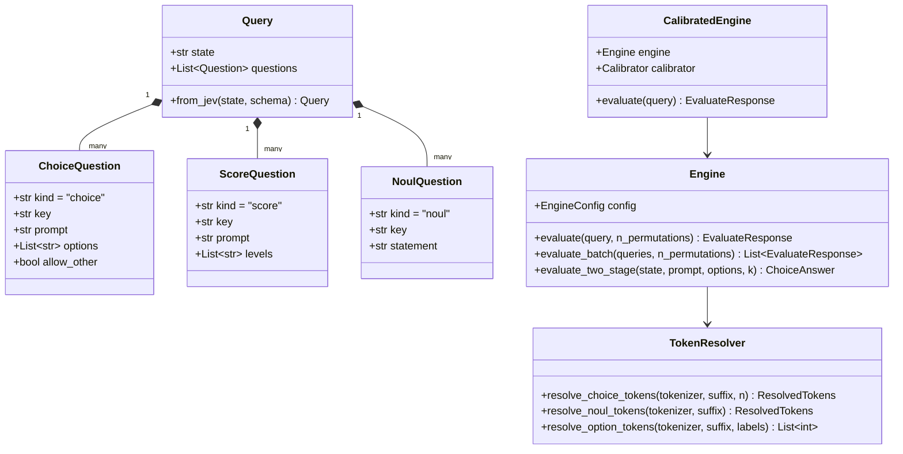
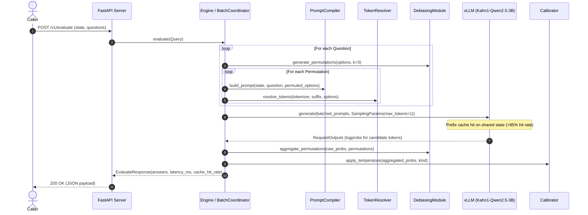
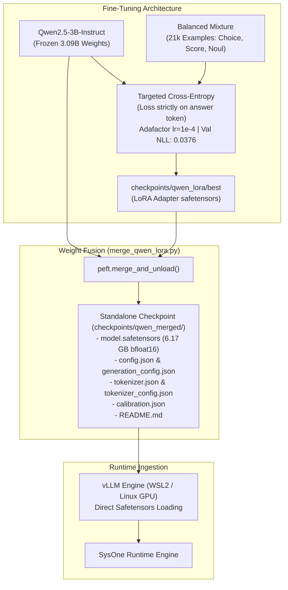
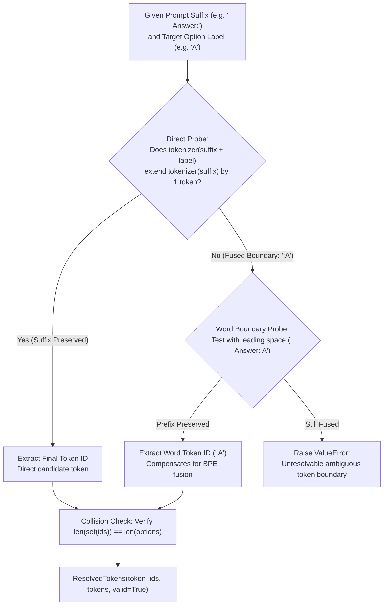
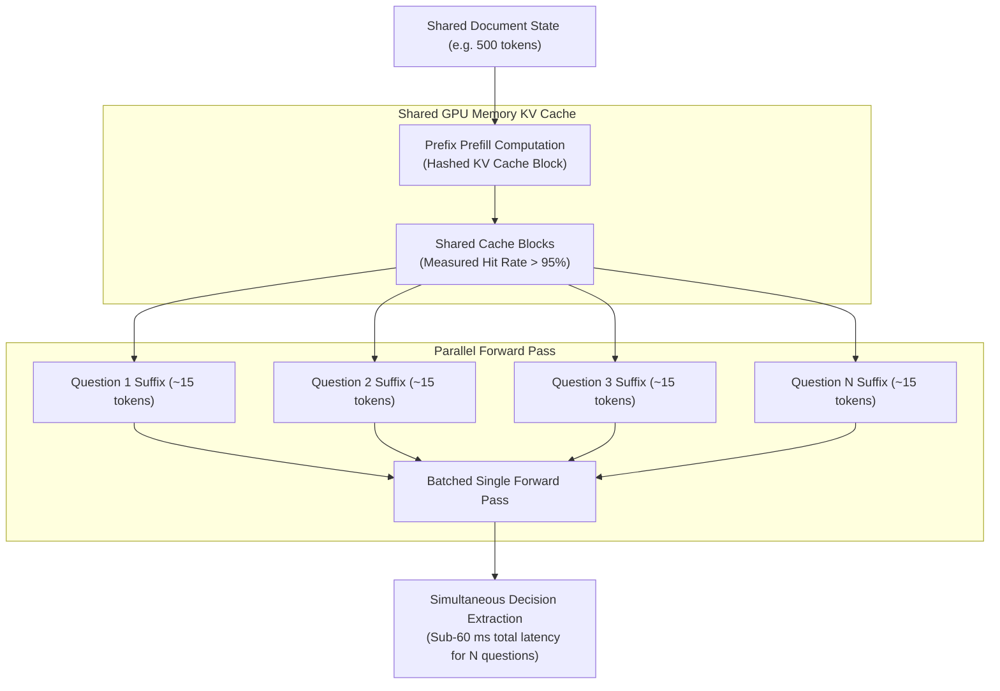
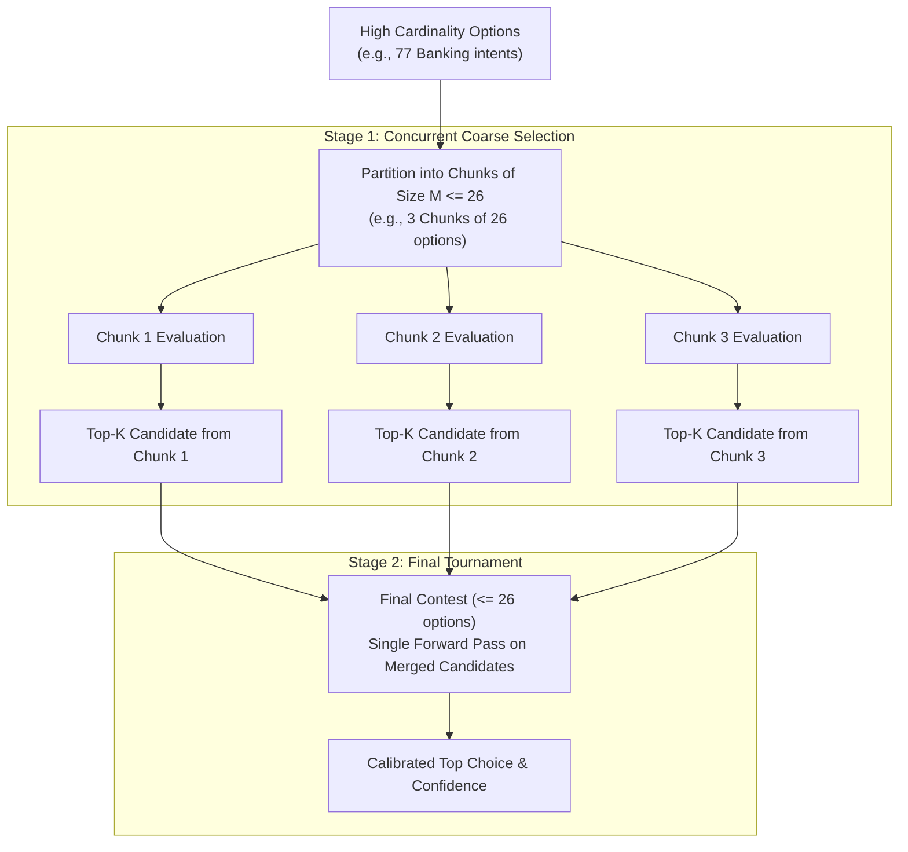
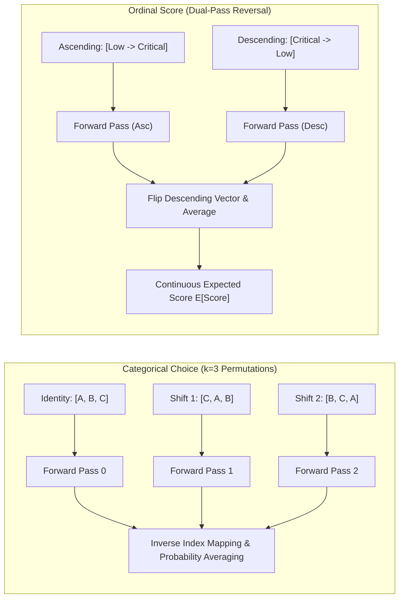
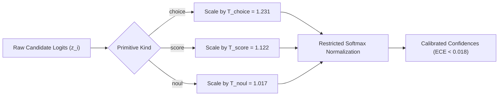

# System Architecture: `sysone` (Kahn1)

This document specifies the technical architecture, internal component design, data flows, and model runtime of the `sysone` repository and the **`Kahn1-Qwen2.5-3B`** model.

---

## 1. System Overview & Core Principles

`sysone` implements a deterministic, ultra-low latency decision engine ("System 1") founded on four core principles:

1. **Zero Text Generation**: Eliminates autoregressive token generation, string parsing, and JSON schema decoding on the inference path. Decisions are extracted directly from the probability distribution over candidate tokens.
2. **Direct Single-Token Logits Extraction**: Candidate options (`A`, `B`, `C`... or `yes`/`no`) are resolved as discrete vocabulary IDs, evaluated in a single forward pass, and renormalized strictly over the valid candidate subspace ($\sum_{i \in \mathcal{C}} p_i = 1.0$).
3. **Prefix Caching Amortization**: A common context state (e.g. document, transcript, support ticket) is encoded exactly once in the GPU KV Cache. Multiple concurrent questions are evaluated as lightweight suffix branches in a single batched operation.
4. **Post-Hoc Temperature Calibration & Positional Debiasing**: Probabilities undergo permutation-based positional debiasing and post-hoc temperature scaling ($T_{\text{choice}}, T_{\text{score}}, T_{\text{noul}}$) to guarantee calibrated confidence metrics ($ECE < 0.02$).

```mermaid
flowchart TD
    Client["Client Application / Agent"] -->|Query: State + N Questions| Gateway["FastAPI REST Gateway (/v1/evaluate)"]
    Gateway --> BatchCoord["Engine & Batch Coordinator"]

    subgraph InferencePipeline["sysone Execution Pipeline"]
        BatchCoord --> PromptCompiler["Prompt Compiler (sysone.prompt)\nByte-identical Prefix Assembly"]
        BatchCoord --> TokenResolver["Token Resolver (sysone.tokens)\nBPE Word Boundary Resolution"]
        BatchCoord --> DebiasingEngine["Debiaser (sysone.debias)\nOption Permutations (k=3) & Scale Inversion"]

        DebiasingEngine -->|Single Unified Batch| VLLMRuntime["vLLM Engine (Kahn1-Qwen2.5-3B)\nenable_prefix_caching=True"]
        VLLMRuntime -->|Logits on Candidate Tokens| LogitsProcessor["Logits Processor\nRestricted Softmax Normalization"]
        LogitsProcessor --> DebiasRemap["Debias Aggregator\nInverse Index Probability Averaging"]
        DebiasRemap --> Calibrator["Calibrator (sysone.calibrate)\nTemperature Scaling T_kind"]
    end

    Calibrator --> Formatter["Response Formatter\nTyped Pydantic Output"]
    Formatter --> Gateway
    Gateway -->|Typed Response (0 Schema Errors)| Client
```

---

## 2. Repository Layout & Component Architecture

The codebase enforces strict modularity and separation of concerns under `src/sysone/`:

```
src/sysone/
├── types.py       # Pydantic domain models (Query, Question, Choice, Score, Noul, EvaluateResponse)
├── prompt.py      # Template formatting with byte-identical state prefix preservation
├── tokens.py      # Universal BPE boundary detection and vocabulary token ID resolution
├── engine.py      # Core batched execution engine, vLLM wrapper, and two-stage cascade
├── debias.py      # Positional permutation generation and ordinal dual-pass reversal
├── calibrate.py   # Temperature scaling and isotonic regression calibration
├── server.py      # FastAPI asynchronous REST application and endpoints
└── cli.py         # Command-line interface for evaluation and calibration
```



---

## 3. Data Flow & Unified Inference Pipeline

The inference flow processes a user query from raw request to validated decision through a sequence of deterministic transformations:



---

## 4. Model Architecture: `Kahn1-Qwen2.5-3B`

The backbone model is **`Kahn1-Qwen2.5-3B`**, specialized for deterministic System 1 classification:

- **Base Model**: `Qwen/Qwen2.5-3B-Instruct` (3.09B parameters, 28 layers, 16 attention heads, hidden size 2048).
- **Precision**: Native `bfloat16` safetensors (~6.17 GB on disk).
- **Memory Footprint**: ~1.26 GB VRAM during vLLM runtime, leaving $>14.5$ GB for KV Cache on a 16 GB GPU.
- **LoRA Adaptation**: Trained with rank $r=16, \alpha=32$ targeting all linear projection layers (`q_proj`, `k_proj`, `v_proj`, `o_proj`, `gate_proj`, `up_proj`, `down_proj`).
- **Standalone Fusion**: Merged via `peft.merge_and_unload()` into unified safetensors, eliminating dynamic adapter runtime overhead.



---

## 5. Universal BPE Tokenizer Boundary Resolution (`tokens.py`)

Modern byte-pair encoding (BPE) tokenizers (such as Qwen, Llama 3, and Gemma) fuse punctuation and alphanumeric characters into composite tokens depending on whitespace context. `sysone.tokens` guarantees exact token ID mapping via a two-stage probing mechanism:



---

## 6. Shared-Prefix KV Caching & Multi-Question Batching

Evaluating $N$ queries against a single context state utilizes vLLM's PagedAttention and automatic prefix caching:



---

## 7. Two-Stage Cascade for High Cardinality (> 26 options)

When the option pool exceeds the single-letter alphabet capacity ($N > 26$), `sysone.engine` executes a two-stage tournament cascade to maintain constant inference latency and prevent prompt length explosion:



---

## 8. Positional & Ordinal Debiasing Pipeline (`sysone.debias`)

To eliminate positional preference (e.g. primacy bias towards option `A`), the engine applies primitive-aware debiasing:

1. **Categorical Choice Questions**: Evaluates $k$ circular or random permutations of the candidate options. Predicted probabilities are mapped back to their canonical indices and averaged in probability space:
   $$\bar{p}_i = \frac{1}{k} \sum_{j=1}^k p_{\pi_j(i)}$$
2. **Continuous Ordinal Score Questions**: Shuffling options breaks ordinal topology. The engine applies **Dual-Pass Order-Reversal Debiasing**, evaluating the scale ascending $[L_0, \dots, L_{M-1}]$ and descending $[L_{M-1}, \dots, L_0]$, neutralizing the structural midpoint attractor.
3. **Continuous Expectation Computation**: Ordinal answers are resolved as continuous scores:
   $$\mathbb{E}[\text{Score}] = \sum_{i=0}^{M-1} i \cdot \bar{p}_i$$



---

## 9. Post-Hoc Probability Calibration Architecture (`sysone.calibrate`)

Raw logits extracted from neural backbones are systematically overconfident. `sysone.calibrate` scales logits using task-specific temperatures fitted via negative log-likelihood (NLL) minimization:

$$p_i = \frac{\exp(z_i / T_{\text{kind}})}{\sum_j \exp(z_j / T_{\text{kind}})}$$

- **$T_{\text{choice}} = 1.231$**: Softens overconfidence on multi-class classification.
- **$T_{\text{score}} = 1.122$**: Calibrates monotonic ordinal score distributions.
- **$T_{\text{noul}} = 1.017$**: Calibrates binary verification decisions.



---

## 10. Production Runtime & REST Server Architecture (`sysone.server`)

The `sysone.server` module wraps the calibrated engine inside a high-throughput, asynchronous REST server using FastAPI and Uvicorn:

```mermaid
flowchart TD
    Client["Client / Upstream Microservice"] -->|HTTP / JSON| Server["FastAPI Application (sysone.server)"]
    
    subgraph Endpoints["HTTP Endpoints"]
        Health["GET /health\nLiveness, GPU Memory, Model Name"]
        Eval["POST /v1/evaluate\nNative SysOne Query Protocol"]
        EvalJev["POST /v1/evaluate/jev\nTypeSafe JEV Protocol Compatible"]
        CalibReload["POST /v1/calibrate/load\nHot-reload Temperature Parameters"]
    end
    
    Server --> Health
    Server --> Eval
    Server --> EvalJev
    Server --> CalibReload
    
    subgraph CoreEngine["Engine Singleton"]
        Eval --> PydanticValidation["Pydantic Validation (Query Schema)"]
        EvalJev --> AdapterConversion["Convert from JEV Dict Schema"]
        AdapterConversion --> PydanticValidation
        PydanticValidation --> EngineExec["CalibratedEngine.evaluate()"]
    end
    
    EngineExec --> Server
    Server -->|JSON Response (Latency + Cache Metrics)| Client
```

### Protocol Compatibility:
- **Native SysOne Format (`/v1/evaluate`)**: Accepts structured `Query` objects with heterogeneous `Question` lists (`choice`, `score`, `noul`).
- **Canonical TypeSafe JEV Format (`/v1/evaluate/jev`)**: Natively accepts dictionary-based schema definitions conforming to `{"schema": {"key": {"type": "choice", "options": [...]}}}` for zero-friction migration.
