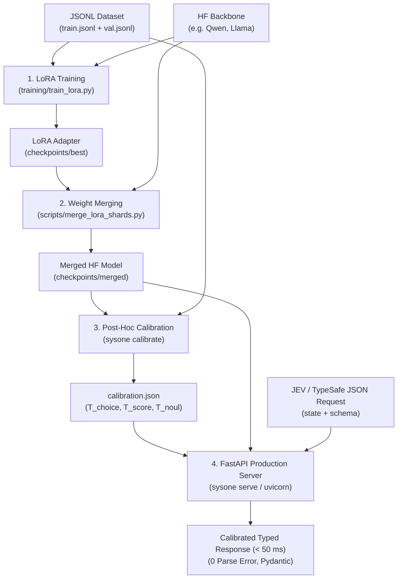

# Reproduction & Adaptation Playbook for `sysone`

This step-by-step playbook explains how to retrain, adapt, and deploy `sysone` with:
1. **Your own custom domain data** (customer support, healthcare, legal, finance, etc.).
2. **Another open-weights language model** (e.g. `meta-llama/Llama-3.2-3B-Instruct`, `Qwen/Qwen2.5-7B-Instruct`, etc.).

---

## Table of Contents
- [1. End-to-End Pipeline Architecture](#1-end-to-end-pipeline-architecture)
- [2. Preparing Your Custom Data](#2-preparing-your-custom-data)
- [3. Selecting Another Base Model (Backbone)](#3-selecting-another-base-model-backbone)
- [4. Step 1: Supervised LoRA Training](#4-step-1-supervised-lora-training)
- [5. Step 2: Weight Merging for vLLM Inference](#5-step-2-weight-merging-for-vllm-inference)
- [6. Step 3: Post-Hoc Temperature Calibration](#6-step-3-post-hoc-temperature-calibration)
- [7. Step 4: Production Serving & JEV Queries](#7-step-4-production-serving--jev-queries)
- [8. Troubleshooting & GPU Memory Optimization](#8-troubleshooting--gpu-memory-optimization)

---

## 1. End-to-End Pipeline Architecture

The complete workflow for training a new model or onboarding new domain data consists of 4 sequential steps:



---

## 2. Preparing Your Custom Data

Input data must be in JSON Lines (`.jsonl`) format, where each line represents a single training example.

### JSONL Schema by Question Kind

#### A. Discrete Choice Question (`kind: "choice"`)
```json
{
  "kind": "choice",
  "state": "Hello, I would like to request a refund for order #1234 which arrived damaged.",
  "prompt": "Determine the primary customer intent",
  "options": ["refund", "shipment_tracking", "technical_issue", "general_inquiry"],
  "label": 0
}
```
*Abstention support (`allow_other`)*: To teach the model that none of the candidate options apply, set `"label": -1`. During training and augmentation, this is automatically mapped to the reserved `__other__` token.

#### B. Continuous / Ordinal Score Question (`kind: "score"`)
```json
{
  "kind": "score",
  "state": "The package arrived two days late but customer service was quick to respond.",
  "prompt": "Customer satisfaction level",
  "levels": ["very dissatisfied", "neutral", "very satisfied"],
  "label": 1
}
```
*Note*: `label` is the 0-based integer index of the correct level (`0` = very dissatisfied, `1` = neutral, `2` = very satisfied).

#### C. Boolean Assertion (`kind: "noul"`)
```json
{
  "kind": "noul",
  "state": "I demand an immediate refund by tomorrow or I will instruct my attorney to take legal action.",
  "statement": "The user makes an explicit legal threat",
  "label": 1
}
```
*Note*: `label` is `1` for Yes / True, `0` for No / False.

### Golden Split Rule
Always split your dataset into two strictly disjoint files:
- `data/my_train.jsonl`: 80–90% of examples (used for supervised LoRA fine-tuning).
- `data/my_val.jsonl`: 10–20% of examples (held out strictly for post-hoc temperature calibration).

---

## 3. Selecting Another Base Model (Backbone)

`sysone` is natively **model-agnostic**. The `src/sysone/tokens.py` module dynamically resolves token IDs for option letters (`A, B, C...` or `yes / no`) according to the active model's tokenizer.

### Recommended Backbones:
- **Qwen 2.5 3B** (default backbone): `Qwen/Qwen2.5-3B-Instruct` (fastest inference, ultra-low 1.26 GB VRAM footprint).
- **Llama 3.2 3B**: `meta-llama/Llama-3.2-3B-Instruct`.
- **Qwen 2.5 7B**: `Qwen/Qwen2.5-7B-Instruct`.

---

## 4. Step 1: Supervised LoRA Training

Launch LoRA fine-tuning with targeted cross-entropy loss:

```bash
# Example with Llama-3.2-3B on custom data
python training/train_lora.py \
  --train data/my_train.jsonl \
  --eval data/my_val.jsonl \
  --model meta-llama/Llama-3.2-3B-Instruct \
  --output-dir checkpoints \
  --micro-batch 4 \
  --grad-accum 4 \
  --lr 1e-4 \
  --val-every 50 \
  --save-every 100
```

### Key Parameters:
- `--max-examples 10000`: Randomly samples 10,000 examples for rapid convergence (~30 minutes).
- `--micro-batch 4`: Number of parallel sequences processed per GPU pass.
- `--grad-accum 4`: Gradient accumulation steps to achieve an effective batch size of `micro-batch * grad-accum = 16`.

The best checkpoint is automatically saved in `checkpoints/best/adapter_model.safetensors` whenever validation NLL improves.

---

## 5. Step 2: Weight Merging for vLLM Inference

vLLM requires a full standalone Hugging Face checkpoint to run at full inference speed with shared Prefix Caching.

Run the merge script:

```bash
python scripts/merge_lora_shards.py \
  --base meta-llama/Llama-3.2-3B-Instruct \
  --lora checkpoints/best \
  --out checkpoints/merged
```

This merges $W_{\text{final}} = W_0 + \frac{\alpha}{r} (B \times A)$ into the base weights and outputs a ready-to-serve directory in `checkpoints/merged/`.

---

## 6. Step 3: Post-Hoc Temperature Calibration

Calibration fits temperature parameters ($T_{\text{choice}}, T_{\text{score}}, T_{\text{noul}}$) via L-BFGS to guarantee that predicted probabilities match observed empirical frequencies ($ECE < 0.05$).

```bash
python -m sysone.cli calibrate \
  --data data/my_val.jsonl \
  --model checkpoints/merged \
  --out calibration.json
```

The resulting `calibration.json` file contains the fitted temperatures for your domain:
```json
{
  "choice": 3.28,
  "score": 17.10,
  "noul": 0.81
}
```

---

## 7. Step 4: Production Serving & JEV Queries

### Start the Inference Server

```bash
SYSONE_MODEL=checkpoints/merged python -m sysone.cli serve --port 8000
```

### Hot-Reload Calibration Parameters

```bash
curl -X POST http://127.0.0.1:8000/v1/calibrate/load \
  -H "Content-Type: application/json" \
  -d '{"path": "calibration.json"}'
```

### Send a Direct JEV Schema Query (`POST /v1/evaluate/jev`)

```bash
curl -X POST http://127.0.0.1:8000/v1/evaluate/jev \
  -H "Content-Type: application/json" \
  -d '{
    "state": "Hello, I cannot log in to my account since this morning. Please fix this quickly and refund my subscription.",
    "schema": {
      "category": {
        "type": "choice",
        "instructions": "Support ticket category",
        "criteria": {
          "bug_report": "Something is broken or producing errors",
          "billing": "Invoices, refunds, subscriptions",
          "account": "Login, credentials, permissions"
        }
      },
      "urgency": {
        "type": "score",
        "instructions": "Level of customer urgency",
        "criteria": [
          "Low (informational)",
          "Medium (inconvenience with workaround)",
          "Critical (blocking)"
        ]
      },
      "refund_request": {
        "type": "noul",
        "instructions": "The customer explicitly asks for a refund or credit"
      }
    },
    "n_permutations": 3
  }'
```

---

## 8. Troubleshooting & GPU Memory Optimization

- **WSL2 OOM / Segmentation Faults**: Set `export PYTORCH_CUDA_ALLOC_CONF=expandable_segments:False` to prevent virtual memory mapping collisions (`cuMemMap`) under WSL2.
- **Inference Acceleration (FP8)**: On modern NVIDIA GPUs (RTX 40xx/50xx, L40, H100), configure `EngineConfig(quantization="fp8")` to double KV-cache token capacity with Cutlass kernels.
- **Permutation Latency Trade-off**: `n_permutations=3` yields optimal positional debiasing (-47.9% variance) while remaining under 55 ms latency. For maximum speed (< 25 ms), set `n_permutations=1`.
